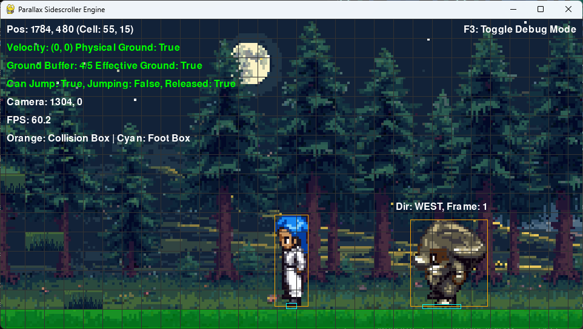

# Sidescroller Engine

A 2D platformer game engine built with Pygame. Features pixel-perfect collision detection, parallax scrolling, and sprite animation.

## Features

- Pixel-perfect collision detection for more accurate gameplay
- Parallax scrolling backgrounds
- Animated sprite system with directional movement
- Multiple enemy types with different behaviors
- Level loading from JSON files
- Debug visualization mode for development
- Physics system with proper ground detection

## Requirements

- Python 3.6+
- Pygame 2.0.0+

## Installation

1. Clone the repository:
```
git clone https://github.com/yourusername/sidescroller-engine.git
cd sidescroller-engine
```

2. Install dependencies:
```
pip install pygame
```

## Running the Engine

Start the engine with:
```
python src/main.py
```

### Controls

- **Arrow Keys** or **WASD**: Move the player
- **Space** or **Up/W**: Jump
- **F3**: Toggle debug mode

## Level Creation

Levels are defined in JSON files located in the `levels/` directory. See the existing level files for examples of the format.

### Level Structure

```json
{
  "dimensions": {
    "width": 64,
    "height": 16,
    "cell_size": 32
  },
  "assets": {
    "background": "resources/graphics/backgrounds/background_2048_512.png",
    "foreground": "resources/graphics/backgrounds/foreground_2048_512.png",
    "platform_image": "resources/graphics/platform.png"
  },
  "parallax": {
    "bg_scroll_rate": 0.2,
    "fg_scroll_rate": 0.8
  },
  "platforms": [
    {"x": 10, "y": 12, "width": 5, "height": 1}
  ],
  "ground_blocks": [
    {"x": 0, "y": 15, "width": 64}
  ],
  "enemies": [
    {"x": 15, "y": 14, "type": "BASIC"},
    {"x": 25, "y": 14, "type": "JUMPING"},
    {"x": 35, "y": 10, "type": "FLYING"}
  ]
}
```

## Debug Mode

Press **F3** during gameplay to toggle debug mode, which displays:

- Grid overlay
- Collision boxes (orange)
- Foot sensors (cyan)
- Position and velocity information
- FPS counter



*Screenshot of the engine running in debug mode, showing pixel-perfect collision boxes around the player and enemies.*

## Development

### Project Structure

```
sidescroller-engine/
├── levels/               # Level JSON files
├── resources/            # Game assets
│   ├── audio/            # Sound effects and music
│   └── graphics/         # Images and sprite sheets
│       ├── backgrounds/  # Background and foreground images
│       ├── characters/   # Player and enemy sprite sheets
│       └── platform.png  # Platform texture
├── src/                  # Source code
│   ├── sprites/          # Game entities
│   │   ├── enemy.py      # Enemy classes
│   │   ├── platform.py   # Platform classes
│   │   └── player.py     # Player class
│   ├── utils/            # Utility modules
│   │   └── constants.py  # Game constants
│   ├── camera.py         # Camera and viewport management
│   ├── game.py           # Main game class
│   ├── level.py          # Level loading and rendering
│   ├── main.py           # Entry point
│   └── menu.py           # Game menus
└── tests/                # Test scripts
    └── output/           # Test output visualizations
```

### Testing

The engine includes visualization tools for debugging sprite collision bounds:

```
python tests/run_bounds_test.py
```

For more comprehensive visualization tests:

```
python tests/run_visualization.py resources/graphics/your_spritesheet.png
```

These tests generate visualizations in the `tests/output/` directory to help analyze sprite collision areas.

## Adding New Sprites

1. Create a sprite sheet with 4x4 frames:
   - Row 1: North-facing animations (4 frames)
   - Row 2: East-facing animations (4 frames)
   - Row 3: South-facing animations (4 frames)
   - Row 4: West-facing animations (4 frames)

2. Place the sprite sheet in `resources/graphics/characters/`

3. Test your sprite collision bounds:
   ```
   python tests/run_visualization.py resources/graphics/characters/your_sprite_sheet.png
   ```

4. Review the output in `tests/output/` to ensure collision bounds work as expected

## License

[Insert license information here]

## Credits

- [List contributors and asset credits]