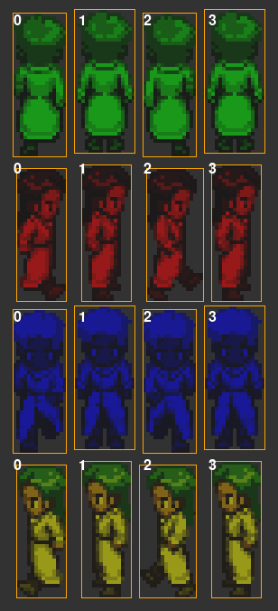

# Enemy Bounds Testing Tools

This directory contains tools for testing and visualizing sprite bounds in the sidescroller engine.

## Overview

The bounds testing tools help you:

1. Verify that enemy sprite bounds are calculated correctly
2. Visualize the calculated bounding boxes for each frame and direction
3. Generate comparison images showing how bounds differ across animation frames
4. Test with custom sprite sheets to ensure proper bounds detection

## Available Scripts

### 1. Bounds Testing

Tests the bounds calculation on a sprite sheet without generating visualizations.

```bash
python tests/run_bounds_test.py path/to/your/sprite_sheet.png
```

This script:
- Loads the specified sprite sheet
- Calculates bounds for each frame in each direction
- Displays calculated bounds and dimensions for each frame
- Verifies that bounds are consistent and appropriate

### 2. Bounds Visualization

Generates detailed visualizations of sprite bounds to help with debugging and analysis.

```bash
python tests/run_visualization.py path/to/your/sprite_sheet.png
```

This script generates several visualization files in the `tests/output` directory:

- **sprite_sheet_grid.png**: The entire sprite sheet with a grid overlay showing frame divisions
- **frames_with_bounds.png**: All frames arranged in a grid, each with its orange bounding box
- **frame_[DIRECTION]_[NUMBER].png**: Individual frames with their bounding boxes
- **direction_comparison.png**: Color-coded overlay visualizing how bounds differ between directions
- **legend.png**: A legend explaining the colors used in the visualizations

## Sprite Sheet Requirements

For best results, your sprite sheet should:

1. Use a 4x4 grid layout (16 frames total)
2. Have directions organized by row:
   - Row 0 (top): NORTH (up-facing frames)
   - Row 1: EAST (right-facing frames)
   - Row 2: SOUTH (down-facing frames)
   - Row 3 (bottom): WEST (left-facing frames)
3. Have 4 animation frames per direction (one in each column)
4. Use transparency (alpha channel) to define the sprite's visible area

If your sprite sheet has a different structure, you may need to modify the test scripts.

## Understanding the Output

### Bounds Format

Bounds are reported in the format `(min_x, min_y, max_x, max_y)`:
- `min_x`: Left edge of the bounding box
- `min_y`: Top edge of the bounding box
- `max_x`: Right edge of the bounding box (exclusive)
- `max_y`: Bottom edge of the bounding box (exclusive)

The width and height can be calculated as:
- `width = max_x - min_x`
- `height = max_y - min_y`

### Visualization Colors

In the direction comparison visualization:
- **Green**: NORTH (up-facing frames)
- **Red**: EAST (right-facing frames)
- **Blue**: SOUTH (down-facing frames)
- **Yellow**: WEST (left-facing frames)
- **Orange**: Bounding box outline

## Example Output

Here's an example of the visualization output:



*Visualization showing sprite frames with orange bounding boxes that precisely match the visible pixels of the sprite.*

## Example Use Cases

1. **Debug collision issues**:
   ```bash
   python tests/run_visualization.py resources/graphics/characters/armadillo_warrior_ss.png
   ```
   Examine the resulting visualizations to see if the bounding boxes properly track the visible parts of the sprite.

2. **Test a new sprite sheet**:
   ```bash
   python tests/run_visualization.py resources/graphics/characters/new_enemy.png
   ```
   Verify that bounds are calculated correctly for your new sprite.

3. **Compare different sprite sheets**:
   Run the visualization on multiple sprite sheets and compare the results.

## Tips

- To debug collision issues, pay close attention to how bounds change between different directions.
- Inconsistent bounds between similar frames might indicate transparency issues in your sprite sheet.
- Remember that frame bounds are cached during enemy initialization for performance, so changes to the sprite sheet during runtime won't be reflected in the bounds.